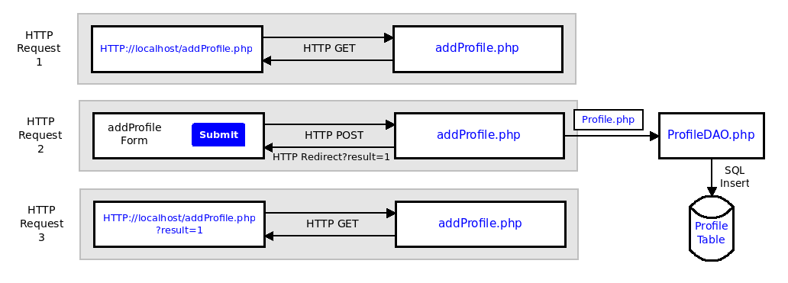

[](https://classroom.github.com/a/_YDyiRBE)
## March 8 Exercise: Profile - Add Form and ProfileDAO


Create a form to add a profile to the MySQL profiles table in the **mar8DB** database.  Complete the **HTML form page**(*addProfile.php*), **Data Transfer Object**(*Profile.php*), and **Data Access Object**(*ProfileDAO.php*). Verify your add form is working by *checking the profiles table in the MySQL client*. Style your HTML using BootStrap.

### Setup Database ###
```
sudo mysql < profile.sql
```

### Display PHP Errors in Browser 

This function sets the error reporting level to E_ALL, which includes all error and warning messages. It also uses the ini_set function to enable the display of errors and startup errors in the browser.

Please note that displaying errors in the browser is helpful during development but should be disabled in a production environment for security reasons. 
```
showErrors(1);  //Display Errors

function showErrors($debug){
   if($debug==1){
      ini_set('display_errors', 1);
      ini_set('display_startup_errors', 1);
      error_reporting(E_ALL);
   }
}
```

#### HTTP Requests Session



